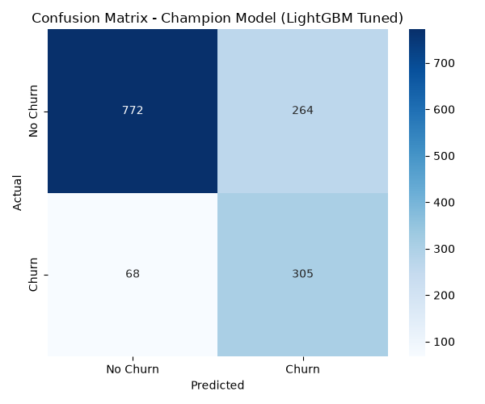
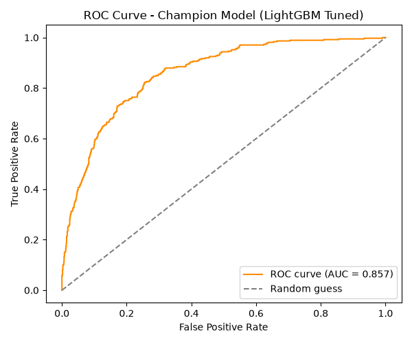
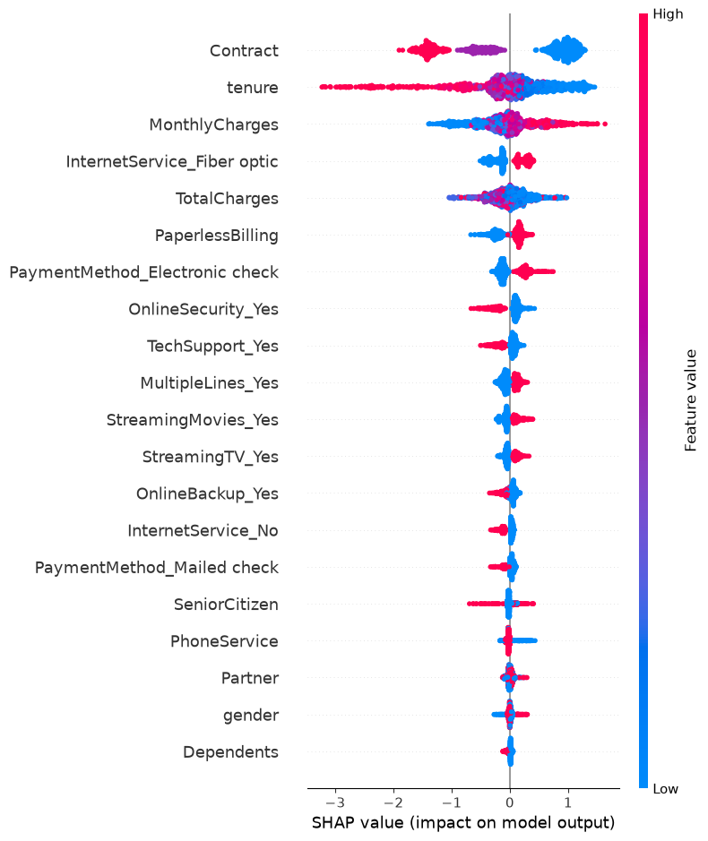

# Customer Churn MLOps

An end-to-end machine learning pipeline that predicts customer churn for a telecommunications company — from raw data to a production-ready REST API, with experiment tracking, explainability, and data drift monitoring.

> **Dataset:** [Telco Customer Churn](https://www.kaggle.com/datasets/blastchar/telco-customer-churn) — 7,043 customers, 19 features, ~26.5% churn rate.

---

## Pipeline Overview

```
Raw CSV → EDA → Preprocessing → Model Training → Evaluation + XAI
                                    ↓                    ↓
                              MLflow Tracking      Artifacts (plots,
                                    ↓               SHAP, confusion)
                          Champion Selection
                                    ↓
                         Export Champion Model
                                    ↓
                      FastAPI REST API ← Docker Container
                                    ↓
                       Evidently Drift Monitoring
                                    ↓
                        Streamlit Monitoring Dashboard
```

---

## Results — Champion Model (LightGBM Tuned)

Selected after an 8-run MLflow experiment comparing Logistic Regression, XGBoost, and LightGBM across baseline and class-imbalance-corrected configurations. Champion chosen for best **F1 score** and near-best recall — not raw ROC-AUC, which would have favoured a less practically useful model.

| Metric | LR Base | LR Balanced | XGB Base | XGB Balanced | LGBM Base | LGBM Balanced | XGB Tuned | **LGBM Tuned ✓** |
|---|---|---|---|---|---|---|---|---|
| Accuracy | 0.821 | 0.749 | 0.798 | 0.770 | 0.802 | 0.775 | 0.762 | **0.764** |
| Precision | 0.685 | 0.517 | 0.639 | 0.553 | 0.649 | 0.553 | 0.534 | **0.536** |
| Recall | 0.601 | 0.823 | 0.542 | 0.681 | 0.550 | 0.780 | 0.807 | **0.818** |
| F1 | 0.640 | 0.635 | 0.586 | 0.611 | 0.595 | 0.647 | 0.642 | **0.648** |
| ROC-AUC | 0.862 | 0.862 | 0.842 | 0.838 | 0.849 | 0.851 | 0.856 | **0.857** |

**Champion params:** `n_estimators=300, max_depth=4, learning_rate=0.05, scale_pos_weight≈2.766`

### Evaluation Plots

<p align="center">
  
  
</p>

<p align="center">
  
</p>

> **SHAP insight:** Contract type, tenure, and MonthlyCharges are the top churn drivers — consistent with the independent EDA findings. Low-signal features from EDA (gender, Partner, PhoneService) show near-zero SHAP spread, confirming the model learned the same signal the manual analysis surfaced.

---

## Project Structure

```
customer-churn-mlops/
├── api/                    # FastAPI REST API
│   └── app.py
├── artifacts/              # Saved encoder, scaler, feature columns, exported model
│   └── champion_model/     # Self-contained model folder (no MLflow tracking store needed)
├── configs/
│   └── config.yaml         # Single source of truth for all paths, features, MLflow settings
├── data/
│   ├── raw/                # Original CSV (DVC-tracked)
│   └── processed/          # train.csv / test.csv (DVC-tracked)
├── docs/
│   ├── plots/              # Confusion matrix, ROC curve, SHAP summary (git-tracked for README)
│   └── *.html              # Pre-generated Evidently drift reports
├── monitoring/
│   ├── dashboard.py        # Streamlit drift monitoring dashboard
│   └── reports/            # Evidently HTML output (gitignored, regenerated locally)
├── notebooks/
│   └── eda.ipynb           # Exploratory data analysis
├── scripts/
│   └── export_champion_model.py   # Exports champion from MLflow store → portable folder
├── src/
│   ├── data_preprocessing.py
│   ├── train.py
│   ├── evaluate.py
│   ├── predict.py
│   └── monitoring.py
├── tests/
│   └── test_preprocessing.py
├── .github/workflows/
│   └── tests.yml           # CI: install → pytest on every push/PR
├── Dockerfile
├── .dockerignore
└── requirements.txt
```

---

## Getting Started

### Prerequisites

- Python 3.13
- Docker (for containerised API)
- Git + DVC (for data versioning)

### 1. Clone and set up environment

```bash
git clone https://github.com/Glen-Rodrigues/customer-churn-mlops.git
cd customer-churn-mlops
python -m venv .venv
.venv\Scripts\activate        # Windows
# source .venv/bin/activate   # macOS/Linux
pip install -r requirements.txt
```

### 2. Get the data

The raw and processed data are DVC-tracked (pointer files are committed), but no DVC remote is configured for this project — `dvc pull` will not work. Download [`Telco-Customer-Churn.csv`](https://www.kaggle.com/datasets/blastchar/telco-customer-churn), place it in `data/raw/`, then run:

```bash
python src/data_preprocessing.py
```


### 3. Train models and run experiments

```bash
python src/train.py
```

This runs 8 MLflow-tracked experiments (LR, XGBoost, LightGBM — baseline and tuned variants). Results are logged to `mlflow.db`. To inspect them:
```bash
mlflow ui --backend-store-uri sqlite:///mlflow.db
```

### 4. Evaluate the champion model

```bash
python src/evaluate.py
```

Loads the champion run from `config.yaml`, generates the confusion matrix, ROC curve, and SHAP summary plot, and prints a false-negative analysis.

### 5. Export the champion model

Required once before running the API (or after retraining):
```bash
python scripts/export_champion_model.py
```

This saves a self-contained model folder to `artifacts/champion_model/` so the API doesn't need the MLflow tracking store at runtime.

### 6. Run the API locally

```bash
uvicorn api.app:app --reload
```

API docs available at: [http://localhost:8000/docs](http://localhost:8000/docs)

### 7. Run the drift monitoring dashboard

```bash
# Generate reports first (if not already done)
python src/monitoring.py

# Launch dashboard
streamlit run monitoring/dashboard.py
```

---

## API Usage

### Health check

```bash
curl http://localhost:8000/health
# {"status": "ok", "model_loaded": true}
```

### Predict churn

```bash
curl -X POST http://localhost:8000/predict \
  -H "Content-Type: application/json" \
  -d '{
    "gender": "Female",
    "SeniorCitizen": 0,
    "Partner": "Yes",
    "Dependents": "No",
    "tenure": 1,
    "PhoneService": "No",
    "MultipleLines": "No phone service",
    "InternetService": "DSL",
    "OnlineSecurity": "No",
    "OnlineBackup": "Yes",
    "DeviceProtection": "No",
    "TechSupport": "No",
    "StreamingTV": "No",
    "StreamingMovies": "No",
    "Contract": "Month-to-month",
    "PaperlessBilling": "Yes",
    "PaymentMethod": "Electronic check",
    "MonthlyCharges": 29.85,
    "TotalCharges": 29.85
  }'
```

**Response:**
```json
{
  "churn_probability": 0.73,
  "churn_prediction": "Yes"
}
```

> All categorical fields use strict `Literal` type validation — a typo like `"Fiber Optic"` instead of `"Fiber optic"` returns a `422` error before it ever reaches the model, preventing silent wrong predictions.

---

## Running with Docker

```bash
# Build
docker build -t churn-api .

# Run
docker run -p 8000:8000 churn-api
```

The image only contains `src/`, `api/`, `configs/`, and `artifacts/` — data files, notebooks, MLflow tracking store, and development tooling are all excluded via `.dockerignore`.

---

## Running Tests

```bash
pytest tests/ -v
```

Tests cover `data_preprocessing.py` pure functions and the `predict.py` preprocessing pipeline, including a column-order independence regression test. The CI pipeline (GitHub Actions) runs these automatically on every push and pull request.

---

## Tech Stack

| Layer | Tools |
|---|---|
| Data versioning | DVC |
| EDA | pandas, matplotlib, seaborn |
| Preprocessing | scikit-learn (OneHotEncoder, StandardScaler), joblib |
| Training | LightGBM, XGBoost, scikit-learn |
| Experiment tracking | MLflow (SQLite backend) |
| Explainability | SHAP |
| Drift monitoring | Evidently |
| REST API | FastAPI, Uvicorn, Pydantic |
| Monitoring dashboard | Streamlit |
| Containerisation | Docker |
| CI | GitHub Actions |
| Testing | pytest |

---

## Known Limitations / Future Work

- **No DVC remote configured** — `.dvc/config` is intentionally empty. The raw data can be re-downloaded from Kaggle and the processed data regenerated locally; artifact files are copied directly into the Docker image at build time (`COPY artifacts/`). Setting up a real remote (S3, GCS) adds infrastructure cost that isn't warranted for a local portfolio project. Documented in `project_status.md` Phase 6 as a deliberate tradeoff.

- **CI does not run pipeline or API smoke tests** — the GitHub Actions workflow installs dependencies and runs `pytest tests/`, which covers preprocessing pure functions and the predict.py input pipeline. It does not run `train.py`, `evaluate.py`, or any API endpoint tests. Full pipeline tests would require either real data or mocked artifacts in CI — meaningful effort with no strong payoff for a project that isn't deployed to staging.

- **`requirements.txt` is a full `pip freeze` dump** — 271 packages, including transitive dependencies and development-only tools not needed at runtime. A trimmed production requirements file and a separate dev requirements file would significantly reduce Docker image size. Noted as a known inefficiency; splitting it is a straightforward improvement if the project grows.

---

## Key Design Decisions

- **Config-driven:** `config.yaml` is the single source of truth for all paths, feature lists, MLflow settings, and the champion run ID. No magic strings anywhere in the code.
- **Artifact persistence over re-derivation:** the fitted encoder, scaler, and feature column order are saved at training time and loaded at inference time — never re-fitted on inference data.
- **Column-order safety:** `predict.py` reindexes incoming data to the training-time column order before passing it to the model, preventing silent wrong predictions from position-based NumPy input.
- **Champion export for portability:** the champion model is exported to a plain folder (`artifacts/champion_model/`) so the API doesn't depend on the MLflow tracking store's local absolute paths — which break inside Docker.
- **Multi-metric champion selection:** the champion was chosen for best F1 + recall balance, not max ROC-AUC (which would have incorrectly selected an LR variant). The run ID is pinned explicitly in `config.yaml` to preserve this human judgment call.
